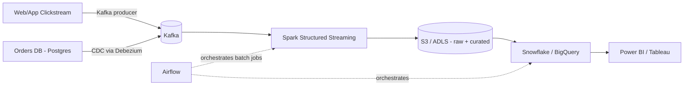
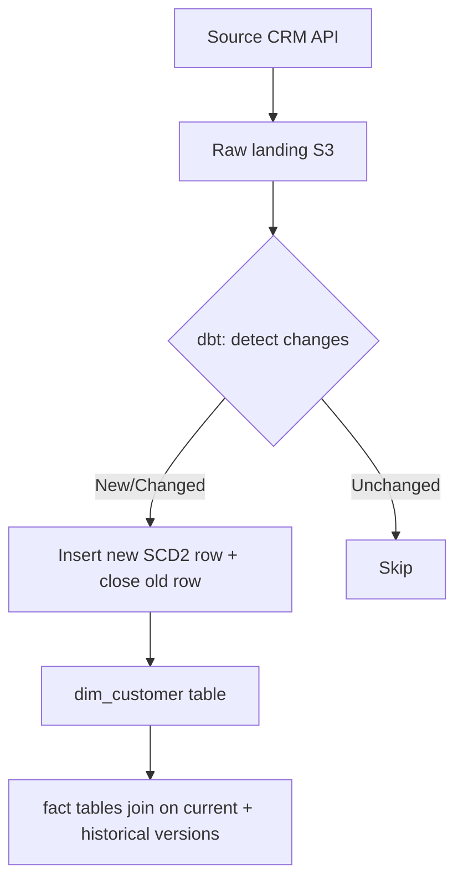

# 11 — System Design for Data Engineers

## Case Study 1: Design a pipeline to ingest e-commerce clickstream + order data for analytics



**Key decisions to discuss in an interview:**
- Streaming (Kafka+Spark) for clickstream because of volume/velocity; CDC (Debezium/DMS) for OLTP orders to avoid hammering the production DB.
- Lambda vs Kappa architecture: Lambda = separate batch + speed layers (more complex, handles reprocessing well); Kappa = everything through streaming layer, replay from log for reprocessing (simpler, needs long retention).
- Partition strategy in the lake: by `event_date` for time-based pruning.
- Data quality gate before the curated zone — bad data should not reach BI dashboards.

## Case Study 2: Design a Slowly Changing customer dimension pipeline at scale


## Scalability Patterns
- **Partitioning** — split data by date/region so queries scan less.
- **Sharding** — split OLTP DB horizontally across servers by key (customer_id range/hash).
- **Read replicas** — offload reporting queries from the primary transactional DB.
- **Caching layer** (Redis) — for frequently-hit aggregates in dashboards.
- **Idempotent pipelines** — design loads so re-running a failed job doesn't duplicate data (use MERGE/UPSERT, not blind INSERT).
- **Backfill strategy** — parametrize DAGs by execution date so historical reprocessing is a config change, not a rewrite.

## Real-World Architecture Reference Patterns
- **Medallion Architecture** (Databricks): Bronze (raw) → Silver (cleaned/conformed) → Gold (business-level aggregates for BI).
- **Lambda Architecture**: batch layer (accuracy) + speed layer (low latency) merged at serving layer.
- **Kappa Architecture**: single streaming pipeline, reprocess via replay instead of maintaining a separate batch layer.

## Interview Framework (how to answer any system design question)
```
1. Clarify requirements: data volume, latency needs (real-time vs daily batch), consumers of the data
2. Sketch high-level flow: source -> ingestion -> storage -> processing -> serving
3. Pick specific tools and justify tradeoffs (not just name-drop)
4. Discuss scalability, fault tolerance, data quality, cost
5. Mention monitoring/alerting (e.g., Airflow SLA misses, DQ check failures -> Slack/PagerDuty)
```
