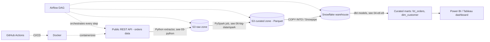

# End-to-End Project: Orders Analytics Pipeline

**Goal**: Build a resume-ready project demonstrating the full stack — API → Cloud Storage → Spark → Warehouse → BI dashboard, fully orchestrated and containerized.

## Architecture

## Steps to Build (in order)
1. **Extract**: Use [`03-python/api-to-db/rest_api_to_postgres.py`](../../03-python/api-to-db/rest_api_to_postgres.py) as a template — swap target for S3 upload instead of Postgres, or do both (raw landing in S3, staging copy in Postgres).
2. **Store raw**: Land JSON/Parquet in `s3://<bucket>/raw/orders/dt=YYYY-MM-DD/`.
3. **Transform**: Run [`06-big-data/spark/spark_batch_job.py`](../../06-big-data/spark/spark_batch_job.py) to clean, dedupe, and aggregate into curated Parquet.
4. **Load to warehouse**: `COPY INTO` Snowflake from the curated S3 path (or use Snowpipe for near-real-time auto-ingest).
5. **Model with dbt**: staging + mart models per [`04-etl-elt/dbt_example/models_example.sql`](../../04-etl-elt/dbt_example/models_example.sql), with `dbt test` data quality checks.
6. **Orchestrate**: wire all steps into one Airflow DAG per [`04-etl-elt/airflow/etl_dag_example.py`](../../04-etl-elt/airflow/etl_dag_example.py).
7. **Containerize + CI/CD**: package with [`10-devops/docker/Dockerfile`](../../10-devops/docker/Dockerfile), deploy via [`10-devops/ci-cd/github-actions-pipeline.yml`](../../10-devops/ci-cd/github-actions-pipeline.yml).
8. **Visualize**: connect Power BI/Tableau to the Snowflake mart tables, publish a dashboard with monthly sales trend, region breakdown, and top products.

## What this project demonstrates to a recruiter
- Full pipeline ownership (not just a notebook)
- Cloud storage + warehouse + orchestration + BI in one coherent flow
- Data quality gates and idempotent, re-runnable design
- DevOps maturity (containerized, CI/CD-deployed)

## Stretch Goals
- Add a streaming variant using Kafka (see `06-big-data/kafka/`) for real-time order events alongside the daily batch.
- Add Great Expectations or Soda for more formal data quality testing.
- Add Terraform to provision the S3 buckets/Snowflake warehouse as infrastructure-as-code.
